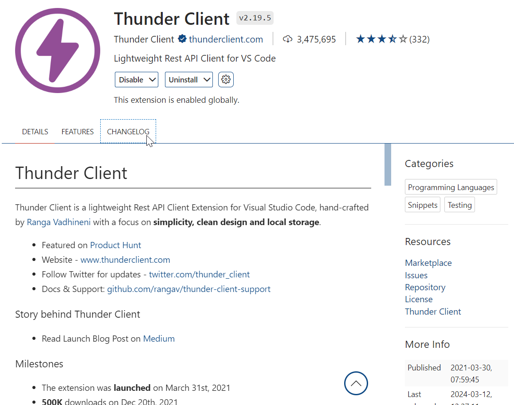
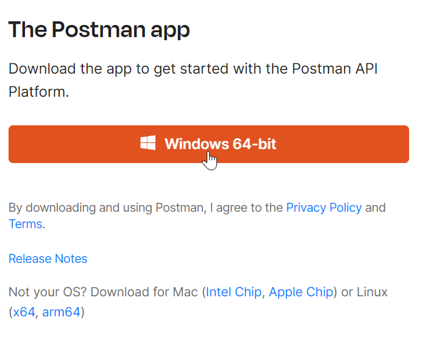
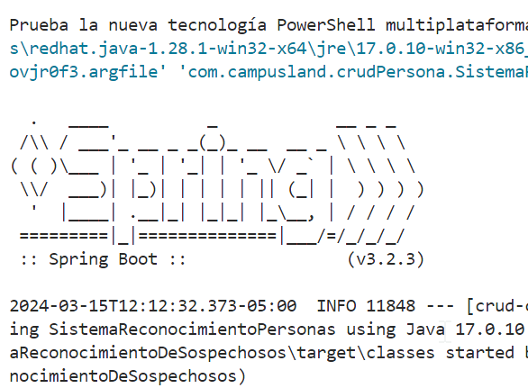
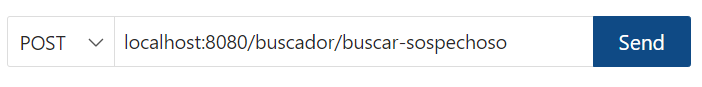
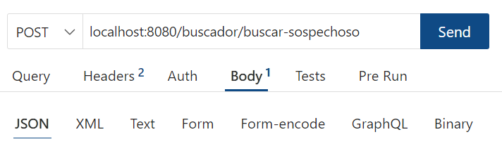
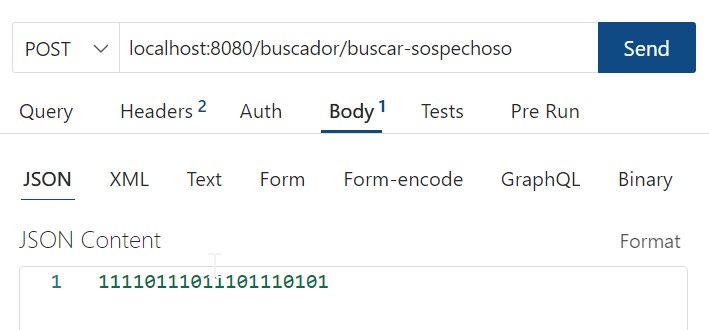
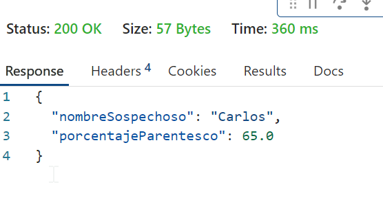

<center><h1>Sistema de Reconocimiento de sospechosos</h1></center>
<br>
<h1><marquee behavior="scroll" direction="left">Herramientas</marquee></h1>

### Visual Studio Code
```sql
si estás usando Visual recomiendo la extensión Thunder Client
```
<div style="text-align:center;">
  
</div>

### Postman
```sql
si no quieres usar Visual tambien está la opción de Postman en modo descarga desktop
```
<div style="text-align:center;">
  
</div>

### Postman en Visual
```sql
Si quieres postman en visual también hay una extensión:
```
https://marketplace.visualstudio.com/items?itemName=Postman.postman-for-vscode
<div style="text-align:center;">
  
</div>

<h1><marquee behavior="scroll" direction="left">Modo de uso</marquee></h1>

```sql
De cualquier manera siga los siguientes pasos:
```

### Active el servidor de SpringBoot

<div style="text-align:center;">
  
</div>

### Ahora entre a la extensión de postman o thunder client
```sql
Recuerde digitar la url, como es versión de prueba es localhost:8080.

Tampoco olvidar que quiere hacer si quiere recibir datos es por get
Post para mandar datos.

Recordar también colocar el endpoint del controlador al que quiere acceder.

(los Endpoints los puede ver en la carpeta controllers)
```

<div style="text-align:center;">
  
</div>

```sql
Así se vería la url con el endpoint correspondiente:

como es un BodyRequest para mandar datos se usa el modo json
```

<div style="text-align:center;">
  
</div>

```sql
Ya por ultimo colocar en el json el contenido que quiere mandar,
en este caso son numeros como cromosomas para comparar entre datos:
```

<div style="text-align:center;">
  
</div>

### Resultado:

<div style="text-align:center;">
  
</div>

```sql
también se pueden mandar mas sospechosos en crear persona
el url es el siguiente:

localhost:8080/personas/

recordar cambiar al metodo post y hacer lo correspondiente en el bodyRequest

como es json se agregan personas en formato json:
{
    "id": 10,
    "nombre": "Javier",
    "apellido": "Gómez",
    "email": "javier@example.com",
    "cromosoma": "00000101010101010101"
}

algo así sería un ejemplo perfecto de como agregar mas personas en Json.

El resto de funcionalidad de codigo lo puede ir encontrando segun lo que deseé
en los controladores
```